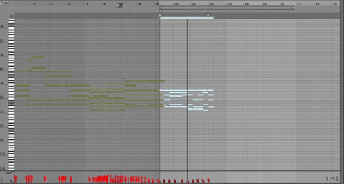
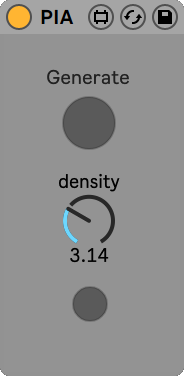

## The Piano Inpainting Application
The Piano Inpainting Application (PIA) is an A.I.-based [Ableton Live](https://www.ableton.com/en/live/) plugin allowing to generate piano performances in an interactive way.

A more detailed presentation is available on the [accompanying website](https://ghadjeres.github.io/piano-inpainting-application/).

### How to use
You can download the  plugin [here](https://github.com/Ghadjeres/piano-inpainting-application/releases/download/v0.1-alpha/PIA.amxd) and simply drag and drop the `PIA.amxd` file within Ableton Live's  MIDI plugin section. 

Select a region in the MIDI track you wish to edit by specifying it using the loop selector (CMD + L) and click on PIA's *Generate* button. The *density* knob controls how many notes per second the inpainted region should have. The last button is used to set the *density* knob to the actual note density of the selected region.

Since PIA is fast and responsive, you should immediately see the selected region erased and new notes appearing. You can even listen to the music while it is being generated!

Note that you must be connected to the Internet so that PIA can work.

### PIA's behavior
Here are some insights about the inner-workings of PIA:
- All notes *starting* in the selected region will be removed.
- The first note generated by PIA will start *exactly* add the beginning of the loop brace.
- The maximum number of notes PIA can generate for a single click on the *Generate* button is set to 256. If you request PIA to compose more than 256 notes (if you choose to recompose a large region with a high note density for instance), only the first 256 notes will be generated. We thus advise to focus on performing *multiple* local edits.
- If the MIDI performance disappears and reappears instantly without any change, this means that you are experiencing connectivity issues.
- Please check that the loop brace is *active* when you click on *Generate*.
- If there is no note after the region that you selected, PIA will always consider that the piece should end at the end of the loop brace.
- Even if there are notes after the region you selected, these will be removed while PIA is generating. Don't worry, these will be added back when the generation completes. Note that the offsets of these notes can be changed.
- We did not add the possibility to map the *Generate* button on a MIDI controller since this clutters the Ableton Live undo history.
- PIA only works in Session view.
- There is no way to condition PIA on a particular musical style other than providing a musical context.

### How to contribute?
Any feedback is more than welcome! From explaining how you worked with PIA, sharing your creations to proposing improvement suggestions. Please visit the [Discussions tab](https://github.com/Ghadjeres/piano-inpainting-application/discussions).

### Further developments
- This plugin is currently only available for Ableton Live users but please note that a 90-day free trial version of Ableton Live is available.

### Disclaimer
This is an alpha version. This is a research project, not an official product. 
Expect some issues. Please save your important work before experimenting with PIA. No personnal data will be collected.
This version of the plugin will cease functioning by the 1st of April 2021.

> [Gaëtan Hadjeres](https://scholar.google.com/citations?user=wfZF3E0AAAAJ&hl=en), Sony CSL Paris, Feb. 2021.
>
> Many thanks to [Adrien Laversanne-Finot](https://scholar.google.com/citations?user=kWScejIAAAAJ&hl=fr) for his important contributions to this project.
