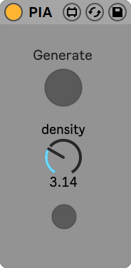

 <!--## The Piano Inpainting Application  -->


### A.I. as creative music assistants
Composing and editing piano performances using a [Digital Audio Workstation](https://en.wikipedia.org/wiki/Digital_audio_workstation) (DAW) can often become a lengthy task as the proper timing, duration and velocity of each note must be set precisely in order to convey the intended emotional effect. If one does not have access to a MIDI keyboard, this task might even become impossible to handle.

In this project, we propose to rely on an Artificial Intelligence to interactively compose piano performances through a constant dialogue with a human user. 
To this end, we chose to train our A.I. on a single specific task that we called *piano inpainting task*. Similar to its [counterpart](https://en.wikipedia.org/wiki/Inpainting) in image edition, the piano inpainting task consists in restoring a piano performance where some parts have been occluded by filling in the missing parts. After being trained on a large dataset of piano performances, this A.I. is able to generate convincing and always-renewed proposals in a wide variety of styles.

With access to such an A.I.-assistant, a user can ask the model to generate any region of a MIDI piano performance with little effort. This comprises connecting two parts together, creating a new piece from scratch or even continuing a first sketch recorded on a MIDI keyboard. The user now acts as an artistic director, validating or invalidating the proposals made by the A.I. We hope that this novel approach to music composition will be entertaining and that it will make piano composition accessible to non-professional musicians.

### The Piano Inpainting Application
It was important for us to make this tool usable within DAWs, so that it can be easily integrated within the users workflows while benefiting from all the capabilities offered by modern software for music production. 
The Piano Inpainting Application (PIA) comes as a lightweight [Ableton Live](https://www.ableton.com/en/live/) plugin with the following three-button interface. 

### How to use
You can download PIA using the [Download .amxd](https://github.com/Ghadjeres/piano-inpainting-application/releases/download/v0.1-alpha/PIA.amxd) link above and simply drag and drop the `PIA.amxd` file within Ableton Live's  MIDI plugin section. 

Select a region in the MIDI track you wish to edit by specifying it using the loop selector (CMD + L) and click on PIA's *Generate* button. The *density* knob controls how many notes per second the inpainted region should have. The last button is used to set the *density* knob to the actual note density of the selected region.

Since PIA is fast and responsive, you should immediately see the selected region erased and new notes appearing. You can even listen to the music while it is being generated!

Note that you must be connected to the Internet so that PIA can work.

### Example
In the following video, I show a live recording of an example usage of PIA. Starting from scratch, I successively ask for a continuation of the first proposal, then edit the middle section twice with different note densities before asking for another ending.



### What kind of A.I. model is this?
We are currently writing a scientific paper on the model itself. Our main focus was to make the model as responsive as possible while maintaining high generation capabilities. The code and the model will be released.

### How to contribute?
Any feedback is more than welcome! From explaining how you worked with PIA, sharing your creations to proposing improvement suggestions. Please visit the dedicated [Github Discussions](https://github.com/Ghadjeres/piano-inpainting-application/discussions).

### Disclaimer
This is an alpha version. This is a research project, not an official product. 
Expect some issues. Please save your important work before experimenting with PIA. No personnal data will be collected.

> [Gaëtan Hadjeres](https://scholar.google.com/citations?user=wfZF3E0AAAAJ&hl=en), Sony CSL Paris, Feb. 2021.
>
> Many thanks to [Adrien Laversanne-Finot](https://scholar.google.com/citations?user=kWScejIAAAAJ&hl=fr) for his important contributions to this project.
