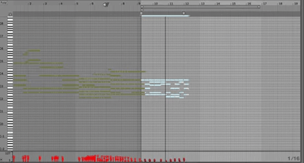

<!--## The Piano Inpainting Application  -->


This is the companion website of the paper [*The Piano Inpainting
Application*](https://arxiv.org/abs/2107.05944) by Hadjeres and Crestel.

### A.I. as creative music assistants
Composing and editing piano performances using a [Digital Audio Workstation](https://en.wikipedia.org/wiki/Digital_audio_workstation) (DAW) can often become a lengthy task as the proper timing, duration and velocity of each note must be set precisely in order to convey the intended emotional effect. If one does not have access to a MIDI keyboard, this task might even become impossible to handle.

In this project, we propose to rely on an Artificial Intelligence to interactively compose piano performances through a constant dialogue with a human user. 
To this end, we chose to train our A.I. on a single specific task that we called *piano inpainting task*. Similar to its [counterpart](https://en.wikipedia.org/wiki/Inpainting) in image edition, the piano inpainting task consists in restoring a piano performance where some parts have been occluded by filling in the missing parts. After being trained on a large dataset of piano performances, this A.I. is able to generate convincing and always-renewed proposals in a wide variety of styles.

With access to such an A.I.-assistant, a user can ask the model to generate any region of a MIDI piano performance with little effort. This comprises connecting two parts together, creating a new piece from scratch or even continuing a first sketch recorded on a MIDI keyboard. The user now acts as an artistic director, validating or invalidating the proposals made by the A.I. We hope that this novel approach to music composition will be entertaining and that it will make piano composition accessible to non-professional musicians.

### The Piano Inpainting Application
It was important for us to make this tool usable within DAWs, so that it can be easily integrated within the users workflows while benefiting from all the capabilities offered by modern software for music production. 
The Piano Inpainting Application (PIA) comes as a lightweight [Ableton Live](https://www.ableton.com/en/live/) plugin with the following three-button interface. 

### How to use
You can download PIA using the [Download .amxd](https://github.com/qhpzsefhy/pia/raw/master/releases/PIA.amxd) link above and simply drag and drop the `PIA.amxd` file within Ableton Live's  MIDI plugin section. 

Select a region in the MIDI track you wish to edit by specifying it using the loop selector (CMD + L) and click on PIA's *Generate* button. The *density* knob controls how many notes per second the inpainted region should have. The last button is used to set the *density* knob to the actual note density of the selected region.

Since PIA is fast and responsive, you should immediately see the selected region erased and new notes appearing. You can even listen to the music while it is being generated!

Note that you must be connected to the Internet so that PIA can work.

### Examples
#### Live usage of PIA
In the following video, I show a live recording of an example usage of PIA. Starting from scratch, I successively ask for a continuation of the first proposal, then edit the middle section twice with different note densities before asking for another ending.



#### Interactive composition made easy
The following example was composed using the PIA plugin as in the
video shown above in under
3 minutes: Generation of
a first proposal from scratch, copy and paste of this proposal, asking PIA
to generate a transition between the two copies and regenerating an
ending.

<audio controls> <source src="{{site.baseurl}}/assets/audio/PIA2.mp3"
type="audio/mpeg"></audio>

#### Unconditional Generation

The following example was generated from scratch using no constraint
and no human intervention:

<audio controls> <source src="{{site.baseurl}}/assets/audio/wallnotes.mp3"
type="audio/mpeg"></audio>

#### Generation conditioned on onsets
As described in the paper, PIA can be conditioned only on a sequence
of note onsets and can regenerate all the remaining missing
information (pitch, velocity and duration).

The following example shows how an existing piano piece can be
recomposed by PIA while keeping all notes onsets identical.

The first audio is the original file from which the note onsets are
extracted and the second one is the PIA-generated version (no human interaction).

<audio controls> <source src="{{site.baseurl}}/assets/audio/moz.mp3"
type="audio/mpeg"></audio>
<audio controls> <source src="{{site.baseurl}}/assets/audio/from_moz.mp3"
type="audio/mpeg"></audio>

We note that PIA is able to develop coherent melodic patterns based on the
rhythmic patterns from the input, while generating in a modern style.

---

This suggests an intuitive way to condition PIA by inputting the
onsets using a one-octave MIDI keyboard. Here is for instance  a
recording I made:

<audio controls> <source
src="{{site.baseurl}}/assets/audio/onsets.mp3"
type="audio/mpeg"></audio>

We can ask PIA to generate only the pitches while keeping the velocities
and note durations identical:

<audio controls> <source src="{{site.baseurl}}/assets/audio/from_onsets_only.mp3"
type="audio/mpeg"></audio>

However, since the velocities and durations from the original file are
a bit harsh, we can ask PIA to also generate velocities and note
durations:

<audio controls> <source src="{{site.baseurl}}/assets/audio/from_onsets.mp3"
type="audio/mpeg"></audio>

Despite the unusual rhythm from the original piece, PIA manages to
produce interesting musical ideas (no human intervention).

#### Regenerating constrained tokens
As described in Sect. 3.3.4, asking PIA to also regenerate constrained
tokens leads surprisingly to the generation of novel sequences that
still present similarities with the constrained sequence. The
following examples showcase two generations (Fig. 4) using this generation
method: both sequences were obtained by conditioning on the same constraint
sequence (no human intervention).

<audio controls> <source src="{{site.baseurl}}/assets/audio/absurdgen1.mp3"
type="audio/mpeg"></audio>
<audio controls> <source src="{{site.baseurl}}/assets/audio/absurdgen2.mp3"
type="audio/mpeg"></audio>

 ---
